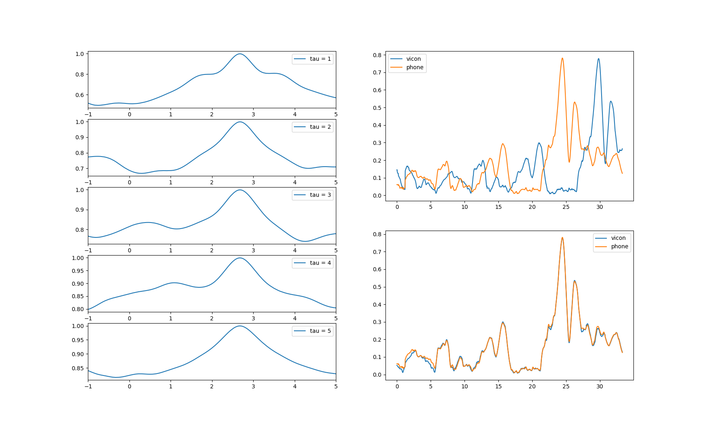

# Align two trajectory's timestamps 

Given two trajectories from such as ARKit, ARCore and Vicon etc. this code can align the timestamps using NCC or least square method(coming soon)

<div align=center>
    
</div>


### Trajectory Format

we use tum fromat to record the both of two trajectory
```
timestamp p.x p.y p.z q.x q.y q.z q.w
```

Also, it is supported to align the raw gyr data to the Vicon trajectory, the gyr data format is 

```
timestamp RX RY RZ
```

### Usage

```
mkdir build && cd build && cmake ..
make 
cd ..
./build/ncc ./data/vicon_traj.txt ./data/phone_traj.txt
python plot.py
```

